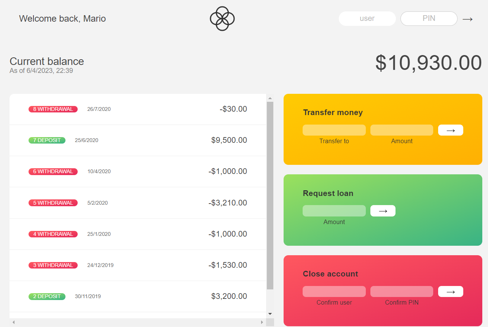
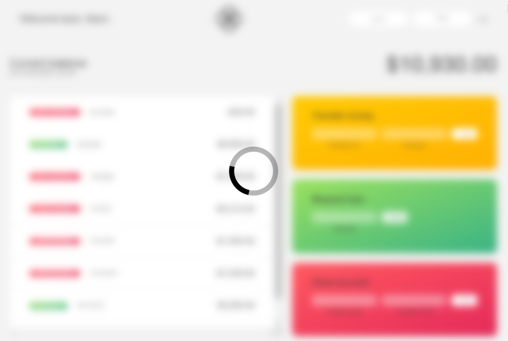

# Bankist-V2

Bankist is a fictitious online banking platform that is designed to showcase modern web development technologies and practices. The project consists of a web application that allows users to create accounts, view their account balance, transfer money between accounts, and view transaction histories.

To make the Bankist project even more robust and maintainable, I am rebuilding it using the Model-View-Controller (MVC) architecture pattern. This approach separates the concerns of the application into distinct layers, making the code more modular, easier to maintain, and less prone to errors.

Additionally, I am using SASS (Syntactically Awesome Style Sheets) for styling the Bankist project. SASS is a CSS preprocessor that provides powerful features like variables, mixins, and functions, making it easier to create reusable and maintainable CSS code.

Overall, the Bankist project rebuild using MVC and SASS will provide a more structured, modular, and maintainable codebase, making it easier to build and maintain modern web applications.

## App View

## Loader for transactions

